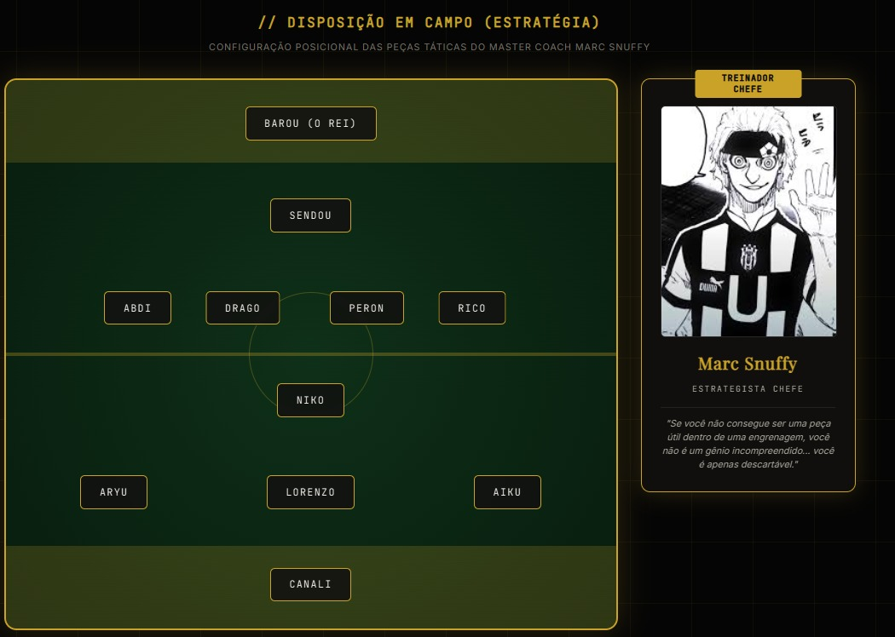
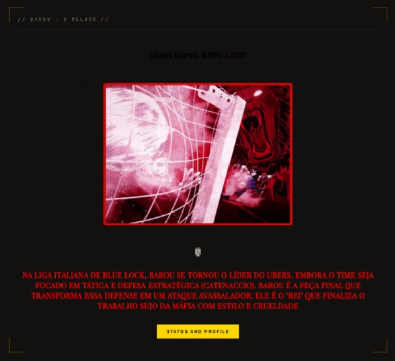

# Ubers
Aplicação web desenvolvida com o objetivo de consolidar conceitos avançados de estruturação com HTML5, estilização e layouts complexos com CSS3 (Flexbox, CSS Grid, Pseudo-elementos, Glassmorphism), e manipulação dinâmica de elementos via JavaScript.

# ⚙ Ubers

  
  
  
  

---

## 📝 Descrição do Projeto

O **Ubers** é um projeto de aplicativo web desenvolvido para rodar direto no navegador. 

> 💡 *O objetivo do aplicativo é informar sobre os Principais Jogadores do Ubers e Mostrar a Formação do Time e suas Regras "*

  

---

## 🎮 Como Testar

Você pode testar o projeto de duas formas:

### 🌐 1. Pelo Navegador (GitHub Pages)
O projeto está hospedado e rodando online! Acesse o link abaixo para acessar agora mesmo:
👉 **[CLIQUE AQUI PARA Acessar](https://shadowvoidh.github.io/Ubers/)**

### 💻 2. Executando Localmente
Se quiser rodar o projeto na sua máquina para ver o código funcionando:
1. Clone este repositório ou baixe os arquivos.
2. Abra a pasta do projeto no seu editor de código (como o **VS Code**).
3. Instale a extensão **Live Server** no VS Code.
4. Abra o arquivo `index.html` e clique no botão **Go Live** no canto inferior direito da tela.

---

## 🛠️ Tecnologias Utilizadas

O projeto foi construído utilizando as principais tecnologias da Web:

| Tecnologia | Função no Projeto |
| :--- | :--- |
| **HTML5** | Estruturação dos elementos da página e containers do jogo. |
| **CSS3** | Estilização visual, cores, posicionamento e responsividade. |
| **JavaScript** | Toda a lógica do jogo, movimentação e interatividade. |

---

## 🚀 Próximos Passos / Funcionalidades Futuras

O projeto ainda está recebendo melhorias! Aqui estão algumas ideias que pretendo implementar:
- [ ] Criar efeitos sonoros para as ações principais.
- [ ] Deixar o visual adaptado para telas de celular.

---

  

##  👤 Autor

Desenvolvido com programação e dedicação. 

* **Shadow_Voidh** - (https://github.com/shadowvoidh)